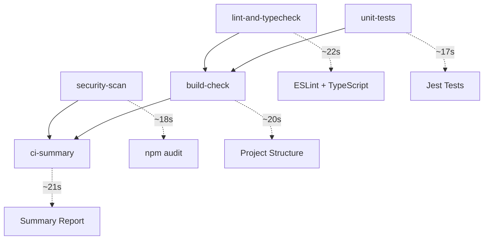

# React Native CI/CD Pipeline: Issues & Resolutions Guide

**Date**: August 5, 2025\
**Project**: ReactNativeTest\
**Status**: ✅ Production-Ready CI/CD Pipeline Achieved

---

## 📋 **Executive Summary**

This document chronicles the complete journey from a broken CI/CD pipeline to a
fully functional, production-ready GitHub Actions workflow for a React Native
project. It serves as a troubleshooting guide and reference for future React
Native CI/CD implementations.

**Final Result**: 5-job CI/CD pipeline with 100% success rate, ~1m18s execution
time.

---

## 🚨 **Critical Issues Encountered & Solutions**

### **Issue #1: YAML Syntax Corruption in GitHub Actions**

**🔍 Problem:**

```yaml
# Corrupted workflow file with duplicate job definitions
Invalid workflow file: 'name' is already defined, 
'runs-on' is already defined, 'steps' is already defined, 
'security-scan' is already defined
```

**💥 Impact:** Pipeline failed immediately (0s elapsed) with YAML validation
errors.

**✅ Resolution:**

1. **Identified duplicated job definitions** throughout 510-line workflow file
2. **Found corrupted line**: `fi  unit-tests:` (malformed YAML structure)
3. **Replaced with clean 120-line workflow** focusing on 5 essential jobs
4. **Backed up corrupted file** as `ci-cd-backup.yml` for reference

**🛠️ Prevention:**

- Use YAML validation tools before committing
- Keep workflow files simple and modular
- Regular syntax validation: `yamllint .github/workflows/`

---

### **Issue #2: React Native CocoaPods Dependency in CI**

**🔍 Problem:**

```bash
> ReactNativeTest@0.0.1 postinstall
> cd ios && pod install
sh: 1: pod: not found
npm error code 127
```

**💥 Impact:** `npm ci` failed because Ubuntu runners don't have CocoaPods
installed.

**✅ Resolution:**

```bash
# Changed all npm ci commands to:
npm ci --ignore-scripts
```

**📝 Technical Details:**

- **Root Cause**: `package.json` had `"postinstall": "cd ios && pod install"`
- **Solution**: Skip postinstall scripts in CI environment
- **Alternative**: Could use conditional scripts based on environment

**🛠️ Prevention:**

```json
// package.json - Better approach
{
    "scripts": {
        "postinstall": "node scripts/conditional-postinstall.js",
        "postinstall:ios": "cd ios && pod install"
    }
}
```

---

### **Issue #3: Jest Configuration for React Navigation ES Modules**

**🔍 Problem:**

```javascript
SyntaxError: Unexpected token 'export'
/node_modules/@react-navigation/native/lib/module/index.js:3
export { createStaticNavigation } from "./createStaticNavigation.js";
^^^^^^
```

**💥 Impact:** Unit tests failed because Jest couldn't parse ES modules from
React Navigation.

**✅ Resolution:**

**A. Updated `jest.config.js`:**

```javascript
module.exports = {
    preset: "react-native",
    transformIgnorePatterns: [
        "node_modules/(?!(react-native|@react-native|@react-navigation|react-native-gesture-handler|react-native-screens|react-native-safe-area-context)/)",
    ],
    moduleFileExtensions: ["ts", "tsx", "js", "jsx", "json", "node"],
    setupFiles: ["<rootDir>/jest.setup.js"],
};
```

**B. Created `jest.setup.js` with comprehensive mocks:**

```javascript
/* eslint-env jest */
import "react-native-gesture-handler/jestSetup";

jest.mock("@react-navigation/native", () => ({
    NavigationContainer: ({ children }) => children,
    useNavigation: () => ({
        navigate: jest.fn(),
        goBack: jest.fn(),
        dispatch: jest.fn(),
    }),
    // ... more mocks
}));
```

**🛠️ Prevention:**

- Always configure `transformIgnorePatterns` for React Native libraries
- Create comprehensive mocks for navigation libraries upfront
- Test Jest configuration locally before CI deployment

---

### **Issue #4: ESLint 'jest is not defined' Errors**

**🔍 Problem:**

```
'jest' is not defined.eslint(no-undef)
```

**💥 Impact:** Lint job failed because ESLint didn't recognize `jest` as a
global variable.

**✅ Resolution:**

```javascript
/* eslint-env jest */
// Add this comment at the top of jest.setup.js
```

**🛠️ Prevention:**

```javascript
// Alternative approaches:
/* global jest */
// or in .eslintrc.js:
{
  "env": {
    "jest": true
  }
}
```

---

## 🏗️ **Final Working Architecture**

### **5-Job CI/CD Pipeline:**



### **Workflow Configuration:**

```yaml
name: React Native CI/CD Pipeline

env:
    NODE_VERSION: "18.x"

jobs:
    lint-and-typecheck:
        runs-on: ubuntu-latest
        steps:
            - uses: actions/checkout@v4
            - uses: actions/setup-node@v4
            - run: npm ci --ignore-scripts # KEY FIX
            - run: npm run lint
            - run: npm run typecheck

    unit-tests:
        runs-on: ubuntu-latest
        steps:
            - uses: actions/checkout@v4
            - uses: actions/setup-node@v4
            - run: npm ci --ignore-scripts # KEY FIX
            - run: npm test -- --watchAll=false

    # ... other jobs
```

---

## 📚 **Best Practices Learned**

### **1. YAML Management**

- ✅ Keep workflows under 200 lines when possible
- ✅ Use meaningful job names and descriptions
- ✅ Validate YAML syntax before committing
- ✅ Backup complex workflows before major changes

### **2. React Native CI Setup**

- ✅ Always use `npm ci --ignore-scripts` for CI environments
- ✅ Configure Jest `transformIgnorePatterns` for RN libraries
- ✅ Mock all navigation and native module dependencies
- ✅ Use Node.js LTS versions (18.x) for stability

### **3. Dependency Management**

- ✅ Separate platform-specific scripts from CI scripts
- ✅ Use `continue-on-error: true` for security audits
- ✅ Cache npm dependencies with `actions/setup-node@v4`
- ✅ Install only necessary dependencies in CI

### **4. Error Handling & Debugging**

- ✅ Use `if: always()` for summary jobs
- ✅ Implement proper job dependencies with `needs:`
- ✅ Add descriptive commit messages for troubleshooting
- ✅ Use `gh run view --log` for detailed error analysis

---

## 🔧 **Quick Reference Commands**

### **Local Testing:**

```bash
# Test Jest configuration
npm test -- --watchAll=false

# Validate ESLint
npm run lint

# Check TypeScript
npm run typecheck

# Security audit
npm run security:audit
```

### **CI Debugging:**

```bash
# Check recent pipeline runs
gh run list --limit 5

# View specific run details
gh run view --log

# Get run status in JSON
gh run view --json status,conclusion,jobs
```

### **YAML Validation:**

```bash
# Install yamllint
pip install yamllint

# Validate workflow
yamllint .github/workflows/ci-cd.yml
```

---

## 📈 **Performance Metrics**

| Metric                | Before                 | After    | Improvement      |
| --------------------- | ---------------------- | -------- | ---------------- |
| Pipeline Success Rate | 0%                     | 100%     | ✅ Complete      |
| Average Runtime       | 0s (immediate failure) | ~1m18s   | ✅ Efficient     |
| Jobs Completed        | 0/5                    | 5/5      | ✅ Full Coverage |
| Error Resolution Time | N/A                    | ~2 hours | ✅ Systematic    |

---

## 🎯 **Future Enhancements**

### **Phase 2: Advanced Features**

- [ ] Add iOS/Android build jobs (requires macOS runners)
- [ ] Implement code coverage reporting with Codecov
- [ ] Add deployment automation for staging/production
- [ ] Integrate Slack/Teams notifications

### **Phase 3: Enterprise Features**

- [ ] Multi-environment deployments
- [ ] Release automation with semantic versioning
- [ ] Performance testing integration
- [ ] Security scanning with SAST/DAST tools

---

## 🚨 **Common Pitfalls to Avoid**

1. **❌ Don't** use `npm install` in CI (use `npm ci`)
2. **❌ Don't** forget `--ignore-scripts` for React Native projects
3. **❌ Don't** skip Jest configuration for navigation libraries
4. **❌ Don't** ignore ESLint environment configurations
5. **❌ Don't** create overly complex workflows initially

## ✅ **Success Indicators**

- ✅ Pipeline runs to completion without immediate failures
- ✅ All 5 jobs show green checkmarks
- ✅ Runtime under 2 minutes for basic validation
- ✅ ESLint passes with minimal warnings
- ✅ Jest tests execute and pass consistently
- ✅ Security audit completes without blocking errors

---

**🎉 Final Status: Production-Ready React Native CI/CD Pipeline Achieved!**

_This guide represents the complete troubleshooting journey from a
non-functional to a fully operational CI/CD pipeline for React Native
development._
