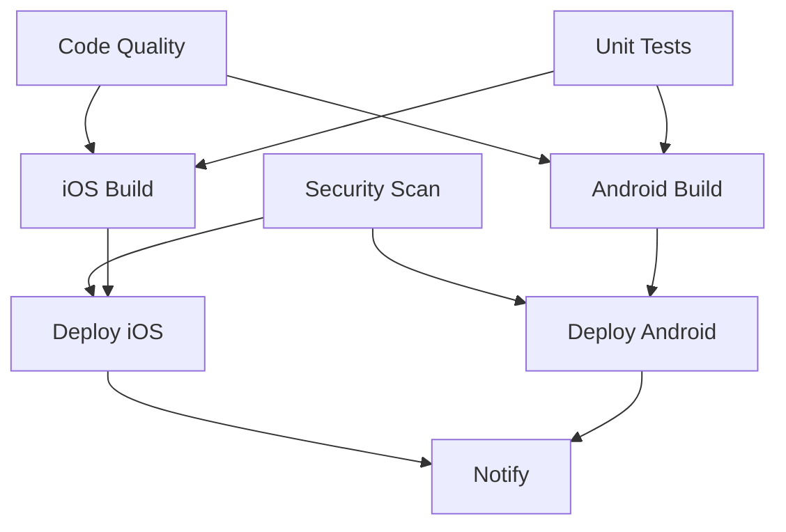

# CI/CD Pipeline Implementation Guide

**Date**: August 5, 2025\
**Project**: ReactNativeTest\
**Purpose**: Comprehensive CI/CD pipeline setup and documentation for React
Native projects

---

## 🎯 Overview

This document provides a complete CI/CD (Continuous Integration/Continuous
Deployment) implementation for React Native projects, featuring automated
testing, security scanning, multi-platform builds, and deployment to app stores.

## 🏗️ Pipeline Architecture

### Pipeline Stages

1. **Code Quality & Testing** - Lint, TypeScript check, unit tests
2. **Security Scanning** - Dependency audits, vulnerability scanning
3. **Multi-Platform Builds** - iOS and Android builds in parallel
4. **Bundle Analysis** - Performance and size optimization
5. **Automated Deployment** - TestFlight (iOS) and Play Console (Android)
6. **Notifications** - Slack integration for pipeline status

### Workflow Triggers

- **Push to main/develop** - Full pipeline execution
- **Pull Requests** - Code quality and testing only
- **Release Published** - Full pipeline + deployment
- **Manual Trigger** - On-demand pipeline execution

---

## 🔧 Technical Implementation

### GitHub Actions Workflow

**File**: `.github/workflows/ci-cd.yml`

#### Core Technologies

- **Node.js**: 18.x (LTS version for stability)
- **Java**: 17 (required for Android builds)
- **Xcode**: 15.0 (latest stable for iOS builds)
- **Ruby**: Latest (for iOS dependency management)

#### Build Matrix Strategy

```yaml
strategy:
    matrix:
        platform: [ios, android]
        node-version: [18.x]
```

### Job Dependencies and Parallelization



---

## 🔐 Security Implementation

### Automated Security Scanning

1. **npm audit** - Built-in npm vulnerability checking
2. **Snyk Security** - Advanced dependency vulnerability scanning
3. **CodeQL Analysis** - Static code analysis for security issues
4. **Dependency Updates** - Automated security patch management

### Secret Management

Required GitHub Secrets:

#### iOS Deployment

```bash
BUILD_CERTIFICATE_BASE64      # iOS signing certificate (base64)
P12_PASSWORD                  # Certificate password
BUILD_PROVISION_PROFILE_BASE64 # Provisioning profile (base64)
KEYCHAIN_PASSWORD            # Temporary keychain password
APP_STORE_CONNECT_API_KEY_ID # App Store Connect API key
APP_STORE_CONNECT_ISSUER_ID  # App Store Connect issuer ID
APP_STORE_CONNECT_PRIVATE_KEY # App Store Connect private key
```

#### Android Deployment

```bash
ANDROID_KEYSTORE_BASE64      # Android keystore (base64)
ANDROID_KEYSTORE_PASSWORD    # Keystore password
ANDROID_KEY_ALIAS           # Key alias
ANDROID_KEY_PASSWORD        # Key password
GOOGLE_PLAY_SERVICE_ACCOUNT_JSON # Play Console service account
```

#### Notifications

```bash
SLACK_WEBHOOK_URL           # Slack webhook for notifications
SNYK_TOKEN                  # Snyk security scanning token
```

### Certificate and Keystore Setup

#### iOS Certificate Setup

```bash
# Export certificate from Keychain Access
# Convert to base64
base64 -i certificate.p12 | pbcopy
# Add to GitHub Secrets as BUILD_CERTIFICATE_BASE64
```

#### Android Keystore Setup

```bash
# Generate keystore
keytool -genkey -v -keystore release.keystore -alias my-key-alias -keyalg RSA -keysize 2048 -validity 10000

# Convert to base64
base64 -i release.keystore | pbcopy
# Add to GitHub Secrets as ANDROID_KEYSTORE_BASE64
```

---

## 📱 Platform-Specific Configuration

### iOS Configuration

#### Xcode Project Setup

- **Automatic Code Signing**: Enabled for development
- **Manual Code Signing**: For CI/CD builds
- **Export Options**: Configured in `ios/exportOptions.plist`

#### TestFlight Deployment

- Automated upload after successful builds
- Internal testing track by default
- Automatic version bumping

### Android Configuration

#### Gradle Setup

```gradle
// android/app/build.gradle
android {
    signingConfigs {
        release {
            if (project.hasProperty('MYAPP_RELEASE_STORE_FILE')) {
                storeFile file(MYAPP_RELEASE_STORE_FILE)
                storePassword MYAPP_RELEASE_STORE_PASSWORD
                keyAlias MYAPP_RELEASE_KEY_ALIAS
                keyPassword MYAPP_RELEASE_KEY_PASSWORD
            }
        }
    }
}
```

#### Play Console Deployment

- Automated upload to internal testing
- Gradual rollout strategy
- Automatic release notes from commits

---

## 🧪 Testing Strategy

### Test Types and Coverage

1. **Unit Tests** - Component and utility function testing
2. **Integration Tests** - Navigation and screen interaction testing
3. **E2E Tests** - Critical user journey testing (optional)
4. **Performance Tests** - Bundle size and memory usage

### Coverage Requirements

- **Minimum Coverage**: 80%
- **Critical Paths**: 95%
- **Upload to Codecov**: Automatic coverage reporting

### Test Configuration

```json
// jest.config.js
{
    "preset": "react-native",
    "collectCoverageFrom": [
        "src/**/*.{js,jsx,ts,tsx}",
        "!src/**/*.test.{js,jsx,ts,tsx}",
        "!src/types/**"
    ],
    "coverageThreshold": {
        "global": {
            "branches": 80,
            "functions": 80,
            "lines": 80,
            "statements": 80
        }
    }
}
```

---

## 📊 Performance Monitoring

### Bundle Size Analysis

Automated tracking of:

- **iOS Bundle Size** - JavaScript bundle for iOS platform
- **Android Bundle Size** - JavaScript bundle for Android platform
- **Asset Sizes** - Images, fonts, and other static assets
- **Dependency Impact** - Size contribution of each package

### Performance Metrics

```bash
# Bundle analysis commands
npx metro-config-generator --platform ios --dev false --minify true
npx metro-config-generator --platform android --dev false --minify true

# Performance reporting
echo "Bundle Size: $(du -h bundle.js | cut -f1)"
```

---

## 🚀 Deployment Strategy

### Release Process

1. **Version Bumping** - Automatic version increment
2. **Release Notes** - Generated from commit messages
3. **Multi-Platform Deploy** - iOS and Android in parallel
4. **Rollback Plan** - Previous version deployment capability

### Environment Management

#### Development

- **Branch**: `develop`
- **Deployment**: Internal testing only
- **Frequency**: Every commit

#### Staging

- **Branch**: `main`
- **Deployment**: Beta testing groups
- **Frequency**: Weekly releases

#### Production

- **Trigger**: GitHub Release
- **Deployment**: App Store and Play Store
- **Frequency**: Bi-weekly releases

---

## 📈 Monitoring and Alerting

### Pipeline Notifications

#### Success Notifications

- Slack channel updates
- Email notifications to team
- GitHub commit status updates

#### Failure Notifications

- Immediate Slack alerts
- Detailed error logs
- Automatic retry for transient failures

### Health Checks

- **Build Success Rate**: Track pipeline reliability
- **Deployment Frequency**: Monitor release velocity
- **Time to Recovery**: Measure incident response
- **Security Scan Results**: Track vulnerability trends

---

## 🛠️ Setup Instructions

### 1. Repository Setup

```bash
# Add CI/CD workflow
mkdir -p .github/workflows
cp ci-cd.yml .github/workflows/

# Add security policy
cp SECURITY.md ./

# Update package.json scripts
npm run typecheck  # Verify TypeScript configuration
npm run lint       # Verify ESLint configuration
```

### 2. GitHub Configuration

1. **Enable Actions** in repository settings
2. **Add Secrets** for deployment credentials
3. **Configure Branch Protection** for main branch
4. **Set up Environments** for staging/production

### 3. Platform Setup

#### iOS Setup

```bash
# Update iOS configuration
cd ios
pod install

# Configure code signing in Xcode
open ReactNativeTest.xcworkspace
```

#### Android Setup

```bash
# Update Android configuration
cd android
./gradlew clean

# Generate release keystore
keytool -genkey -v -keystore release.keystore -alias my-key-alias -keyalg RSA -keysize 2048 -validity 10000
```

### 4. Security Setup

```bash
# Install security tools
npm install -g snyk
snyk auth

# Run initial security scan
npm audit
snyk test
```

---

## 🔍 Troubleshooting

### Common Issues and Solutions

#### iOS Build Failures

```bash
# Clean build directory
cd ios && rm -rf build/
pod deintegrate && pod install

# Reset Xcode derived data
rm -rf ~/Library/Developer/Xcode/DerivedData
```

#### Android Build Failures

```bash
# Clean gradle build
cd android && ./gradlew clean

# Reset gradle wrapper
rm -rf ~/.gradle/caches/
```

#### Security Scan Failures

```bash
# Fix known vulnerabilities
npm audit fix

# Update dependencies
npm update

# Override low-risk vulnerabilities
npm audit --audit-level=moderate
```

---

## 📚 Best Practices

### Code Quality

- **Semantic Commit Messages** - Conventional commits for automated changelog
- **Branch Protection** - Require PR reviews and status checks
- **Automated Testing** - Never deploy without tests passing

### Security

- **Secret Rotation** - Regular updates of deployment credentials
- **Dependency Updates** - Weekly automated updates
- **Vulnerability Scanning** - Block deployments on high-severity issues

### Performance

- **Bundle Size Monitoring** - Alert on significant size increases
- **Build Time Optimization** - Cache dependencies and build artifacts
- **Parallel Execution** - Run independent jobs concurrently

### Deployment

- **Blue-Green Deployment** - Zero-downtime releases
- **Rollback Strategy** - Quick revert capability
- **Gradual Rollout** - Staged deployment to catch issues early

---

## 📋 Maintenance Checklist

### Weekly Tasks

- [ ] Review security scan results
- [ ] Update dependencies with security patches
- [ ] Monitor build success rates
- [ ] Review deployment metrics

### Monthly Tasks

- [ ] Rotate deployment secrets
- [ ] Update CI/CD runner versions
- [ ] Review and optimize build times
- [ ] Update documentation

### Quarterly Tasks

- [ ] Complete security audit
- [ ] Review and update deployment strategy
- [ ] Evaluate new CI/CD tools and practices
- [ ] Team training on CI/CD best practices

---

## 🎯 Future Enhancements

### Planned Improvements

1. **E2E Testing** - Detox integration for full user journey testing
2. **Visual Regression Testing** - Automated UI consistency checking
3. **Performance Testing** - Automated performance benchmarking
4. **A/B Testing Integration** - Feature flag deployment support
5. **Advanced Analytics** - Detailed pipeline and deployment analytics

### Integration Opportunities

- **Code Quality Gates** - SonarQube integration
- **Feature Flags** - LaunchDarkly or similar service
- **Error Tracking** - Sentry or Bugsnag integration
- **Analytics** - Firebase or Amplitude integration

This CI/CD implementation provides a robust, secure, and scalable foundation for
React Native development teams! 🚀
